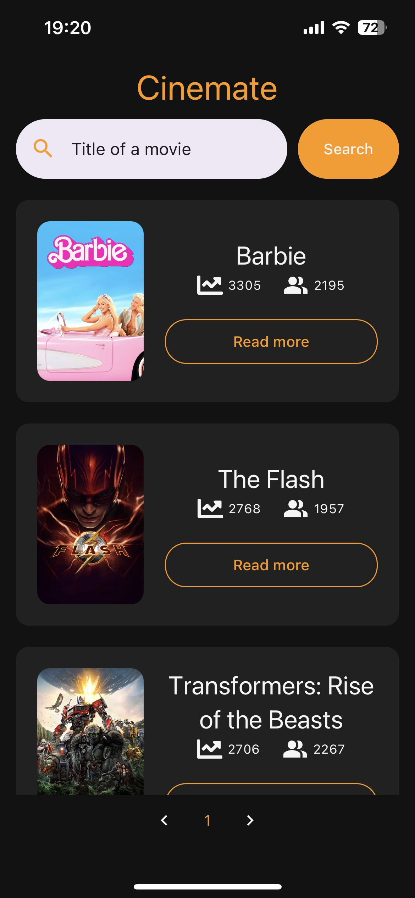
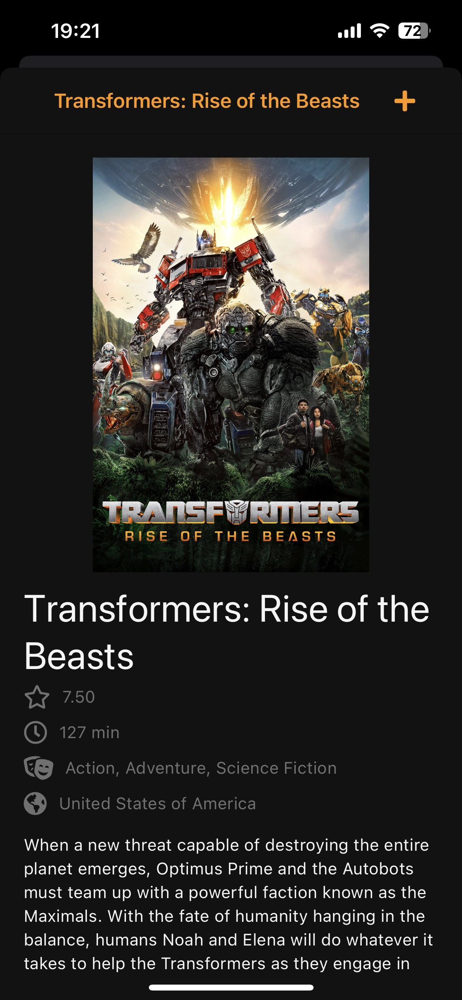
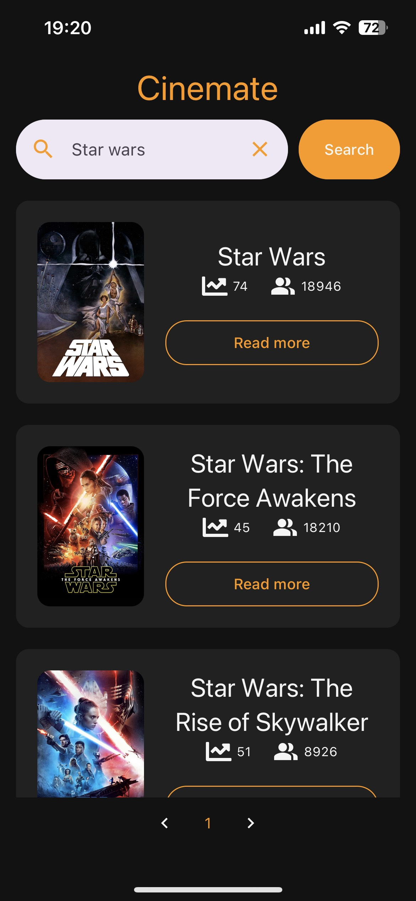

# Cinemate - Movie Browsing App
Cinemate is a mobile application developed using React Native, TypeScript, and Expo that allows users to explore a vast collection of popular films, search for movies by title, and view detailed information about the selected movie.

## Features

- Browse a list of popular films with their titles, posters and popularity
- Search for movies by their titles
- View detailed information about a selected movie, including its synopsis, release date, genres, and ratings
- Easy and intuidive design

## Screenshots

  
  
  

